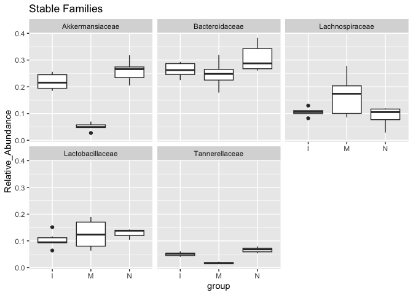
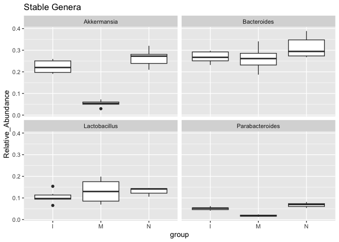
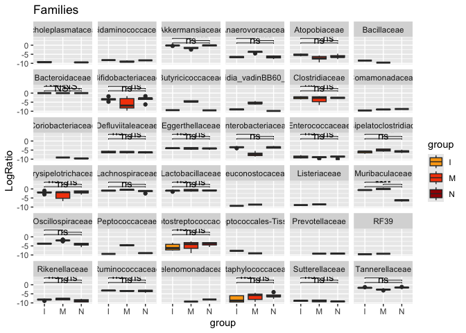
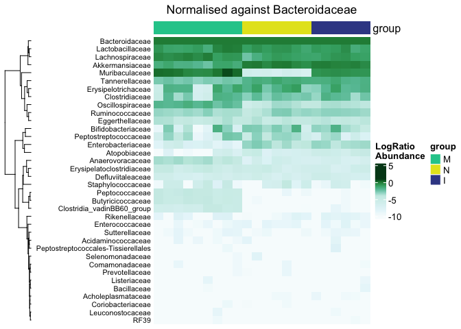

LogRatio work - DP data
================
IP
2024-10-04

### Overview

This uses the same code in the main directory, but applied to DP’s old
data for AS.

## Part 0 - convert phyloseq object to dataframes and calculate relative abundance

``` r
#Function to calculate relative abundance
calc_relative_abunance <- function(data) {
  data <- data %>%
    group_by(Sample) %>%
    mutate(Relative_Abundance = Abundance / sum(Abundance)) %>%
    ungroup()
  return(data)
}
#Columns to remove
unneeded <- c("forward.absolute.filepath","reverse.absolute.filepath")

#Convert phyloseq object to a dataframe for easier dplyr manipulation.
#Calculate relative abundance using our function.
phyloseq_df <- phyloseq_object_final %>% 
  psmelt() %>%
  select(-unneeded) %>%
  calc_relative_abunance()
```

    ## Warning: Using an external vector in selections was deprecated in tidyselect 1.1.0.
    ## ℹ Please use `all_of()` or `any_of()` instead.
    ##   # Was:
    ##   data %>% select(unneeded)
    ## 
    ##   # Now:
    ##   data %>% select(all_of(unneeded))
    ## 
    ## See <https://tidyselect.r-lib.org/reference/faq-external-vector.html>.
    ## This warning is displayed once every 8 hours.
    ## Call `lifecycle::last_lifecycle_warnings()` to see where this warning was
    ## generated.

``` r
#Do the same at family and genus level
phyloseq_fam_df <- phyloseq_object_final %>% 
  tax_glom(taxrank="Family") %>%
  psmelt() %>%
  mutate(Family = gsub("^f__", "", Family)) %>%
  filter(group!="C") %>%
  select(-unneeded) %>%
  calc_relative_abunance()

phyloseq_genus_df <- phyloseq_object_final %>% 
  tax_glom(taxrank="Genus") %>%
  psmelt() %>%
  mutate(Genus = gsub("^g__", "", Genus)) %>%
  filter(group!="C") %>%
  select(-unneeded) %>%
  calc_relative_abunance()
```

## Part 1 - identify stable families

``` r
#To identify "stable" groups as a reference point (low variance between groups and days).
abundance_threshold = 0.01 #threshold for minimum abundance values 
variance_threshold = 0.1 #threshold for maximum variance in abundance across samples

stable_fams <- phyloseq_fam_df %>%
    group_by(Family) %>%
    filter(all(Relative_Abundance > abundance_threshold)) %>%
    summarize(Variance = var(Relative_Abundance),
              Average_RA = mean(Relative_Abundance), 
              .groups = 'drop') %>%
    filter(Variance < variance_threshold) %>%
    select(Family,Average_RA,Variance)

stable_genera <- phyloseq_genus_df %>%
    group_by(Genus) %>%
    filter(all(Relative_Abundance > abundance_threshold)) %>%
    summarize(Variance = var(Relative_Abundance),
              Average_RA = mean(Relative_Abundance), 
              .groups = 'drop') %>%
    filter(Variance < variance_threshold) %>%
    select(Genus,Average_RA,Variance)

stable_fams
```

    ## # A tibble: 5 × 3
    ##   Family           Average_RA Variance
    ##   <chr>                 <dbl>    <dbl>
    ## 1 Akkermansiaceae      0.163  0.00988 
    ## 2 Bacteroidaceae       0.272  0.00219 
    ## 3 Lachnospiraceae      0.125  0.00317 
    ## 4 Lactobacillaceae     0.119  0.00122 
    ## 5 Tannerellaceae       0.0417 0.000526

``` r
stable_genera
```

    ## # A tibble: 4 × 3
    ##   Genus           Average_RA Variance
    ##   <chr>                <dbl>    <dbl>
    ## 1 Akkermansia         0.167  0.0101  
    ## 2 Bacteroides         0.281  0.00223 
    ## 3 Lactobacillus       0.123  0.00129 
    ## 4 Parabacteroides     0.0428 0.000535

#### Cheeky visualisation

``` r
#Define the families of interest, for now leaving their names ugly
families_oi <- stable_fams$Family
genera_oi <- stable_genera$Genus

#Graph relative abundance between group groups.
ggplot(data = (phyloseq_fam_df %>% filter(Family %in% families_oi)),
        aes(x=group, y=Relative_Abundance)) +
  geom_boxplot() +
  labs(title="Stable Families") + 
  facet_wrap(~Family) 
```

<!-- -->

``` r
#Graph relative abundance between group groups.
ggplot(data = (phyloseq_genus_df %>% filter(Genus %in% genera_oi)),
        aes(x=group, y=Relative_Abundance)) +
  labs(title="Stable Genera") +
  geom_boxplot()+
  facet_wrap(~Genus)
```

<!-- -->

## Part 2/3/4 Generate log-ratio values using a reference family/genus.

``` r
# Define our reference family and genus.
ref_fam <- "Bacteroidaceae"
ref_gen <- "Bacteroides"
colours <- c("#FAA613","#F44708","#A10702")
stat_comparisons <- list(c("N","I"),
                         c("N","M"),
                         c("I","M"))

#Mutate dataframes to calculate the abundance ratio and logratio, within samples.
#For 0 values, replace with LOI (half the lowest detected abundance in that sample)
phyloseq_fam_df2 <- phyloseq_fam_df %>% 
  group_by(Sample) %>%
  mutate(min_abundance = min(Abundance[Abundance > 0], na.rm = TRUE),
         # Abundance = ifelse(Abundance == 0, min_abundance / 2, Abundance),
         Ratio = Abundance/Abundance[Family==ref_fam],
         LogRatio = log(Ratio)) %>%
  filter(Ratio!=0)

phyloseq_genus_df2 <- phyloseq_genus_df %>% 
  group_by(Sample) %>%
  mutate(min_abundance = min(Abundance[Abundance > 0], na.rm = TRUE),
         # Abundance = ifelse(Abundance == 0, min_abundance / 2, Abundance),
         Ratio = Abundance/Abundance[Genus==ref_gen],
         LogRatio = log(Ratio)) %>%
  filter(Ratio!=0)

#Create filtered dataframes: contain only taxa which at least 2 groups have measured abundance
phyloseq_genus_df_filtered <- phyloseq_genus_df2 %>% 
  ungroup() %>%  
  group_by(Genus) %>%
  filter(n_distinct(group) >=2) %>%  
  ungroup()

phyloseq_fam_df_filtered <- phyloseq_fam_df2 %>% 
  ungroup() %>%  
  group_by(Family) %>%
  filter(n_distinct(group) >=2) %>%  
  ungroup()

x <- ggplot(phyloseq_fam_df_filtered, aes(x=group, y=LogRatio, fill=group)) +
    geom_boxplot() + facet_wrap(~Family)  + 
    labs(title="Families") +
    scale_fill_manual(values=colours) +
    stat_compare_means(comparisons = stat_comparisons, vjust=0.1,
                     label = "p.signif", 
                     method = "t.test", 
                     bracket.size = 0.3,
                     y.position=1) 
x
```

    ## Warning: Computation failed in `stat_signif()`.
    ## Caused by error in `t.test.default()`:
    ## ! not enough 'y' observations

    ## Warning: Computation failed in `stat_signif()`.
    ## Caused by error in `t.test.default()`:
    ## ! not enough 'x' observations

    ## Warning: Computation failed in `stat_signif()`.
    ## Caused by error in `t.test.default()`:
    ## ! not enough 'x' observations

    ## Warning: Computation failed in `stat_signif()`.
    ## Caused by error in `t.test.default()`:
    ## ! not enough 'x' observations

    ## Warning: Computation failed in `stat_signif()`.
    ## Caused by error in `t.test.default()`:
    ## ! not enough 'x' observations

    ## Warning: Computation failed in `stat_signif()`.
    ## Caused by error in `t.test.default()`:
    ## ! not enough 'x' observations

    ## Warning: Computation failed in `stat_signif()`.
    ## Caused by error in `t.test.default()`:
    ## ! not enough 'y' observations

    ## Warning: Computation failed in `stat_signif()`.
    ## Caused by error in `t.test.default()`:
    ## ! not enough 'x' observations

    ## Warning: Computation failed in `stat_signif()`.
    ## Caused by error in `t.test.default()`:
    ## ! not enough 'x' observations

    ## Warning: Computation failed in `stat_signif()`.
    ## Caused by error in `t.test.default()`:
    ## ! not enough 'x' observations

    ## Warning: Computation failed in `stat_signif()`.
    ## Caused by error in `t.test.default()`:
    ## ! not enough 'x' observations

    ## Warning: Computation failed in `stat_signif()`.
    ## Caused by error in `t.test.default()`:
    ## ! not enough 'y' observations

    ## Warning: Computation failed in `stat_signif()`.
    ## Caused by error in `t.test.default()`:
    ## ! not enough 'x' observations

    ## Warning: Computation failed in `stat_signif()`.
    ## Caused by error in `t.test.default()`:
    ## ! not enough 'x' observations

<!-- -->

``` r
x2 <- ggplot(phyloseq_genus_df_filtered, aes(x=group, y=LogRatio, fill=group)) +
    geom_boxplot() + facet_wrap(~Genus)+ 
    labs(title="Genera") +
    scale_fill_manual(values=colours) +
    stat_compare_means(comparisons = stat_comparisons, vjust=0.1,
                     label = "p.signif", 
                     method = "t.test", 
                     bracket.size = 0.3,
                     y.position=1) 
x2
```

    ## Warning: Computation failed in `stat_signif()`.
    ## Caused by error in `t.test.default()`:
    ## ! not enough 'x' observations

    ## Warning: Computation failed in `stat_signif()`.
    ## Caused by error in `t.test.default()`:
    ## ! not enough 'x' observations

    ## Warning: Computation failed in `stat_signif()`.
    ## Caused by error in `t.test.default()`:
    ## ! not enough 'y' observations

    ## Warning: Computation failed in `stat_signif()`.
    ## Caused by error in `t.test.default()`:
    ## ! not enough 'x' observations

    ## Warning: Computation failed in `stat_signif()`.
    ## Caused by error in `t.test.default()`:
    ## ! not enough 'y' observations

    ## Warning: Computation failed in `stat_signif()`.
    ## Caused by error in `t.test.default()`:
    ## ! not enough 'x' observations

    ## Warning: Computation failed in `stat_signif()`.
    ## Caused by error in `t.test.default()`:
    ## ! not enough 'x' observations

    ## Warning: Computation failed in `stat_signif()`.
    ## Caused by error in `t.test.default()`:
    ## ! not enough 'x' observations

    ## Warning: Computation failed in `stat_signif()`.
    ## Caused by error in `t.test.default()`:
    ## ! not enough 'y' observations

    ## Warning: Computation failed in `stat_signif()`.
    ## Caused by error in `t.test.default()`:
    ## ! not enough 'x' observations

    ## Warning: Computation failed in `stat_signif()`.
    ## Caused by error in `t.test.default()`:
    ## ! not enough 'x' observations

    ## Warning: Computation failed in `stat_signif()`.
    ## Caused by error in `t.test.default()`:
    ## ! not enough 'x' observations

    ## Warning: Computation failed in `stat_signif()`.
    ## Caused by error in `t.test.default()`:
    ## ! not enough 'x' observations

    ## Warning: Computation failed in `stat_signif()`.
    ## Caused by error in `t.test.default()`:
    ## ! not enough 'x' observations

    ## Warning: Computation failed in `stat_signif()`.
    ## Caused by error in `t.test.default()`:
    ## ! not enough 'x' observations

    ## Warning: Computation failed in `stat_signif()`.
    ## Caused by error in `t.test.default()`:
    ## ! not enough 'x' observations

    ## Warning: Computation failed in `stat_signif()`.
    ## Caused by error in `t.test.default()`:
    ## ! not enough 'x' observations

    ## Warning: Computation failed in `stat_signif()`.
    ## Caused by error in `t.test.default()`:
    ## ! not enough 'x' observations

    ## Warning: Computation failed in `stat_signif()`.
    ## Caused by error in `t.test.default()`:
    ## ! not enough 'x' observations

    ## Warning: Computation failed in `stat_signif()`.
    ## Caused by error in `t.test.default()`:
    ## ! not enough 'x' observations

<!-- -->
One thing to note: Muribaculaceae doesn’t show up because it is not
detected in any of the Clostridia_only samples (which makes sense!) and
it is thus filtered out for these boxplots.

### Repeating but as a for loop

Saves each individual boxplot as a pdf in the logratio_plots directory.
Takes a second to run though.

``` r
all_genus <- unique(phyloseq_genus_df$Genus)
all_fams <- unique(phyloseq_fam_df$Family)
colours <- c("#FAA613","#F44708","#A10702")

#Plot all genus graphs
for(g in all_genus){
  filtered <- phyloseq_genus_df %>% filter(Genus==g)
  p <- filtered %>% ggplot(aes(x = group, y = LogRatio, fill = group)) +
    geom_boxplot() +
    labs(title = paste("Boxplot for Genus:", g)) +
    scale_fill_manual(values=colours) +
    theme_minimal()
  plotpath <- file.path("logratio_plots/genus", paste0(g, ".pdf"))
  # ggsave(plotpath, plot = p, width = 8, height = 6)
}
#Plot all family graphs
for(f in all_fams){
  filtered <- phyloseq_fam_df %>% filter(Family==f)
  p <- filtered %>% ggplot(aes(x = group, y = LogRatio, fill = group)) +
    geom_boxplot() +
    labs(title = paste("Boxplot for Family:", f)) +
    scale_fill_manual(values=colours) +
    theme_minimal()
  plotpath <- file.path("logratio_plots/family", paste0(f, ".pdf"))
  # ggsave(plotpath, plot = p, width = 8, height = 6)
}
```

### Generation of complex heatmap

#### Setup - build the dataframe and make it pretty.

``` r
load("DP_phyloseq_object_final.RData")

phyloseq_fam_df3 <- phyloseq_object_final %>% 
    tax_glom(taxrank="Family") %>%
    psmelt() %>%
    mutate(Family = gsub("^f__", "", Family)) %>%
    filter(Family!="uncultured") %>%
    filter(group!="C") %>%
    calc_relative_abunance() %>%
  group_by(Family) %>%
  filter(!(Abundance==0)) %>% ungroup() %>%
   group_by(Sample) %>%
    mutate(min_abundance = min(Abundance[Abundance > 0], na.rm = TRUE),
           Abundance = ifelse(Abundance == 0, 0.5, Abundance),
           Ratio = Abundance/Abundance[Family==ref_fam],
           LogRatio = log(Ratio))  %>%
  ungroup() %>%  
  group_by(Family) %>%
  filter(n_distinct(group) >1 ) %>%  
  ungroup() 

#To do: rename the samples and factor.
x <- phyloseq_fam_df3 %>% group_by(group,Sample) %>% summarise() %>%
  group_by(group) %>%
  mutate(NewGroup = paste0(group, ".", row_number()))
```

    ## `summarise()` has grouped output by 'group'. You can override using the
    ## `.groups` argument.

``` r
desired_order <- c("M.1", "M.2", "M.3", "M.4", "M.5", "M.6", "M.7", "M.8", "M.9", 
  "N.1", "N.2", "N.3", "N.4", "N.5", "N.6", "N.7", 
  "I.1", "I.2", "I.3", "I.4", "I.5", "I.6")

for_heatmap <- phyloseq_fam_df3 %>%
  merge(x[, c("Sample", "NewGroup")], by = "Sample", all.x = TRUE) %>%
  select(NewGroup, OTU, Family, LogRatio) %>%
  spread(key=NewGroup, value=LogRatio, fill=-10)  %>%
  column_to_rownames("Family") %>%
  select(-OTU) %>%
  as.matrix()
for_heatmap <- for_heatmap[, match(desired_order, colnames(for_heatmap))]
```

#### Make the heatmap using the complexheatmap package

``` r
#Colour scheme.
cols <- colorRamp2(c(1.0, 0.5, 0, -1, -2, -3, -4,-8,-10), 
                   c("#00441b", "#006d2c", "#238b45", "#41ae76", "#66c2a4", 
                     "#99d8c9", "#ccece6", "#e5f5f9", "#f7fcfd"))

#Design annotation to add the three groups as colorblocks
group_annotation <- HeatmapAnnotation(
  df = data.frame(group = factor(c(rep("M",9),rep("N",7),rep("I",6)),
                                 levels = c("M","N","I"))),
  annotation_legend_param = list(
        title = "group",
        at = c("M","N","I"), labels = c("M","N","I")),
  col = list(group = c("M" = "#20ca9a", "N" = "#e4e320", "I" = "#3b4994")),
  annotation_height = unit(c(1), "cm")  )

h <- Heatmap(for_heatmap,
        name="LogRatio \nAbundance",
        row_names_side="left",
        column_names_side="top",
        show_row_names = TRUE,
        row_names_gp = gpar(fontsize = 8),
        show_column_names = FALSE,
        cluster_rows = TRUE,
        cluster_columns = FALSE,
        col=cols,
        column_title=paste("Normalised against",ref_fam),
        top_annotation=group_annotation)
h
```

<!-- -->

``` r
# #Save the graph
# png("DP_logratio_heatmap.png",width=20,height=20,units="cm",res=1200)
# draw(h)
# dev.off()
```
